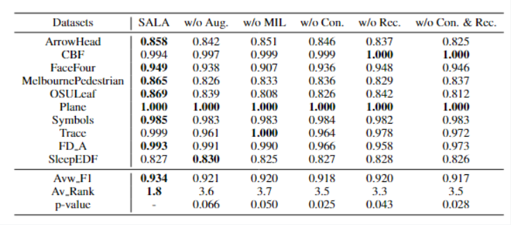
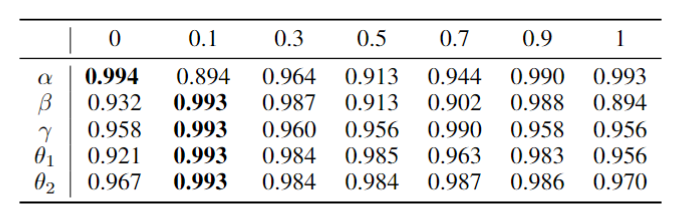

# SALA

**table 1**: Ablation analysis on benchmark and two univariate datasets dealing with 30% symmetric noise. The best results are in **bold**. The p-value is determined using the Wilcoxon signed-rank test.

\
**table 2**: More hyperparameter analysis on the FD-A dataset with 30% symmetric noise. The best results are in **bold**.

